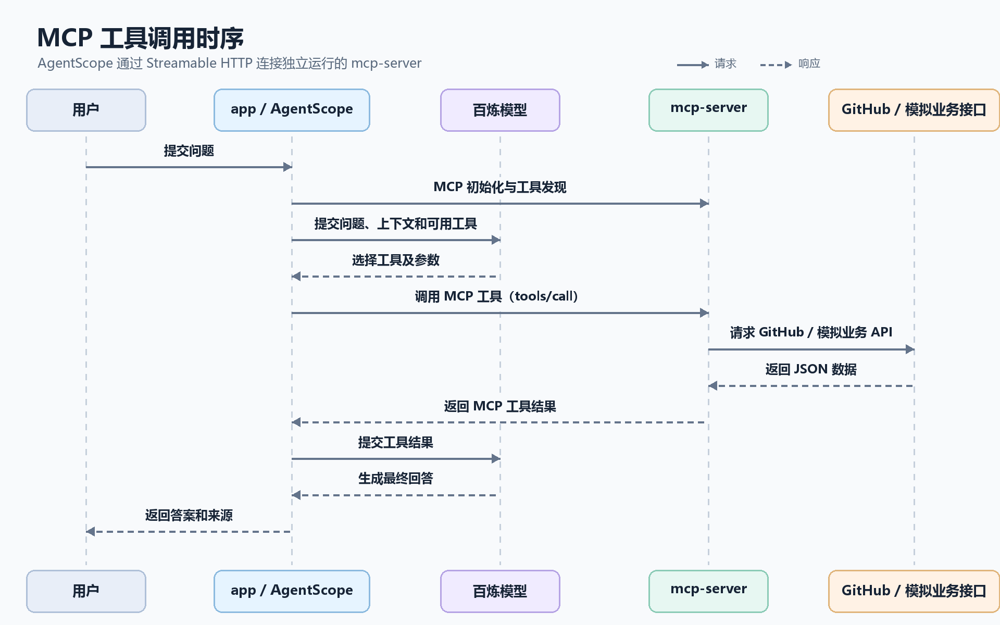

> **这里是怎么实现MCP的，然后MCP怎么和主程序连接起来的？**
>
> 
>
> 这里的 MCP 是**把项目里的 Java 方法包装成 MCP 工具，通过 HTTP 暴露给 AgentScope 调用**。它分成服务端和问答端，靠 `http://127.0.0.1:8081/mcp` 连接。
>
> ### MCP 服务端怎么实现
>
> 启动 `mcp-server` profile 时，Spring 会加载 [McpServerConfiguration.java (line 19)](D:/myProjects/JavaProjects/AgentScopeJavaDemo/src/main/java/com/example/salesagent/mcp/McpServerConfiguration.java:19)。它用官方 MCP Java SDK 建立 **Streamable HTTP** 传输层，并把 MCP 协议端点注册到 `/mcp`。
>
> 这个服务端注册了三个工具：
>
> - `listRepositoryFiles`：列出固定 GitHub 仓库的源码文件。
> - `readRepositoryFile`：读取指定文件。
> - `getProductStatus`：查询模拟商品价格和库存。
>
> 每个工具都声明了名称、说明和参数 Schema。收到 MCP 工具调用后，处理器会检查参数、调用对应 Java 实现，再把结果序列化成 JSON 文本作为 MCP 响应；出错时返回带错误标记的响应。
>
> 工具背后的实现见 [GitHubRepositoryTools.java (line 1)](D:/myProjects/JavaProjects/AgentScopeJavaDemo/src/main/java/com/example/salesagent/tool/GitHubRepositoryTools.java:1) 和 [BusinessTools.java (line 1)](D:/myProjects/JavaProjects/AgentScopeJavaDemo/src/main/java/com/example/salesagent/tool/BusinessTools.java:1)。商品工具会通过 HTTP 请求本项目的模拟业务接口，接口定义在 [DemoBusinessController.java (line 10)](D:/myProjects/JavaProjects/AgentScopeJavaDemo/src/main/java/com/example/salesagent/api/DemoBusinessController.java:10)。
>
> ### 它怎么接到问答主程序
>
> 同一个 Spring Boot 项目可以用两个 profile 启动成两个职责不同的进程：
>
> - `mcp-server`：监听 8081，提供 `/mcp`。
> - `app`：问答主程序；配置在 [application.yml (line 34)](D:/myProjects/JavaProjects/AgentScopeJavaDemo/src/main/resources/application.yml:34) 中，把 MCP 地址设为 `http://127.0.0.1:8081/mcp`。
>
> 主程序的 MCP Client 在 [AgentConfiguration.java (line 22)](D:/myProjects/JavaProjects/AgentScopeJavaDemo/src/main/java/com/example/salesagent/config/AgentConfiguration.java:22) 中创建。它用 AgentScope 的 `McpClientBuilder` 连接该地址、初始化客户端。遇到非闲聊请求时，[SalesAssistant.java (line 132)](D:/myProjects/JavaProjects/AgentScopeJavaDemo/src/main/java/com/example/salesagent/agent/SalesAssistant.java:132) 会把 MCP Client 注册到本轮 Agent 的 Toolkit；闲聊则跳过。
>
> 可以把实际调用过程理解为：
>
> 
>
> 所以，**MCP 负责让 AgentScope 发现并调用工具**；百炼模型负责决定何时调用以及如何组织答案。`/api/chat` 是问答接口，`/mcp` 是 MCP 协议端点，两者用途不同。配置和启动命令也写在 [README.md (line 45)](D:/myProjects/JavaProjects/AgentScopeJavaDemo/README.md:45) 里。


> **怎么样才能被识别为是MCP服务，也就是说这个MCP服务是怎么注册的？**
>
> 
>
> 当前项目**没有 MCP 服务注册中心**。主程序从配置读取 MCP 地址，直接连接服务端；它能被识别为 MCP 服务，是因为 `/mcp` 端点使用 MCP 协议响应握手和工具请求。
>
> 这里的“注册”分三层：
>
> 1. **Spring 注册协议端点**：`mcp-server` profile 加载 [McpServerConfiguration.java (line 19)](D:/myProjects/JavaProjects/AgentScopeJavaDemo/src/main/java/com/example/salesagent/mcp/McpServerConfiguration.java:19)，创建 Streamable HTTP 传输层，并把它映射到 `/mcp`。端口 8081 配置在 [application-mcp-server.yml (line 2)](D:/myProjects/JavaProjects/AgentScopeJavaDemo/src/main/resources/application-mcp-server.yml:2)。
> 2. **MCP Server 注册工具**：同一个配置类用 `McpServer.sync(transport)` 创建服务端，再用 `.toolCall(...)` 注册工具名称、描述、参数 Schema 和对应处理函数。启动后，客户端可通过 MCP 的 `tools/list` 发现工具，之后通过 `tools/call` 调用它们。[协议规范](https://modelcontextprotocol.io/specification/2025-11-25/server/tools)规定了这两个操作。
> 3. **AgentScope 注册 MCP Client**：主程序从 [application.yml (line 34)](D:/myProjects/JavaProjects/AgentScopeJavaDemo/src/main/resources/application.yml:34) 读取 `demo.mcp.url`，在 [AgentConfiguration.java (line 22)](D:/myProjects/JavaProjects/AgentScopeJavaDemo/src/main/java/com/example/salesagent/config/AgentConfiguration.java:22) 创建客户端并调用 `initialize()`。握手会交换协议版本、服务端信息和能力；MCP 规范要求先完成初始化再进行正常操作。[MCP 生命周期规范](https://modelcontextprotocol.io/specification/2025-11-25/basic/lifecycle)
>    非闲聊请求到来时，[SalesAssistant.java (line 132)](D:/myProjects/JavaProjects/AgentScopeJavaDemo/src/main/java/com/example/salesagent/agent/SalesAssistant.java:132) 再调用 `registerMcpClient(...)`，把发现的工具加入本轮 Agent 的 Toolkit，供 AgentScope 使用。
>
> 可以把过程简写成：
>
> ```
> 配置中的 URL
>   → 连接 /mcp
>   → initialize：确认对方说 MCP 协议
>   → tools/list：取得工具名称和参数定义
>   → registerMcpClient：放进 AgentScope Toolkit
>   → tools/call：实际调用工具
> ```
>
> 代码里的两个名字也有不同含义：`serverInfo("sales-demo-tools", ...)` 是握手时提供的服务端信息；`McpClientBuilder.create("sales-tools")` 是客户端本地使用的名称。`tools(false)` 中的 `false` 表示工具列表变化时不发送变更通知；工具仍由后面的 `.toolCall(...)` 注册。


> **MCP 服务注册中心 ，只使用使用 MCP 协议也算MCP吗？**
>
> 
>
> **算。**“遵循 MCP 协议”和“登记到 MCP 服务注册中心”是两回事：
>
> | 项目         | 作用                                                         |
> | ------------ | ------------------------------------------------------------ |
> | MCP 协议     | 规定客户端如何初始化、发现工具并调用工具                     |
> | MCP Registry | 目录服务，保存服务器的名称、地址或安装方式等信息，方便搜索和发现 |
>
> 所以，客户端只要拿到服务地址，并能按 MCP 协议与它通信，就可以使用它；服务不必先发布到 Registry。官方 Registry 的定位也是发布和查询服务器元数据的目录。[官方 Registry 说明](https://github.com/modelcontextprotocol/registry/blob/main/docs/modelcontextprotocol-io/about.mdx)
>
> 套到这个项目里：`mcp-server` 通过 MCP SDK 在 `/mcp` 提供服务；`app` 从 `demo.mcp.url` 直接读取地址并连接。握手成功后，客户端发现工具并调用。对应代码分别在 [McpServerConfiguration.java (line 22)](D:/myProjects/JavaProjects/AgentScopeJavaDemo/src/main/java/com/example/salesagent/mcp/McpServerConfiguration.java:22)、[application.yml (line 34)](D:/myProjects/JavaProjects/AgentScopeJavaDemo/src/main/resources/application.yml:34) 和 [AgentConfiguration.java (line 22)](D:/myProjects/JavaProjects/AgentScopeJavaDemo/src/main/java/com/example/salesagent/config/AgentConfiguration.java:22)。
>
> 有个判断标准：端点名字叫 `/mcp` 还不够，它需要实际实现 MCP 的协议交互；例如客户端能通过 `tools/list` 发现工具，再通过 `tools/call` 调用。[MCP 工具协议](https://modelcontextprotocol.io/specification/2025-11-25/server/tools)
