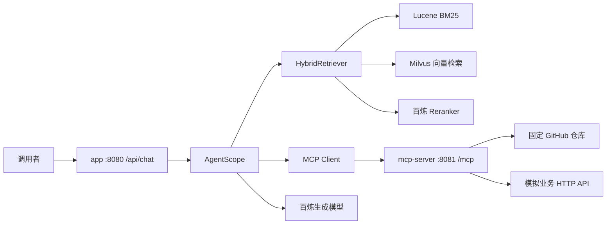

# 销售智能问答 Agent 项目文档

## 1. 项目目标与功能边界

本项目面向销售团队提供产品知识、健康科普和业务资料问答，同时演示读取线上代码仓库和调用实时业务接口。重点是让初学者能从代码中看清完整链路，而不是堆叠多个 Agent 框架。

本项目使用 **Spring Boot + AgentScope Java**。Spring Boot 管理应用和 HTTP 接口，AgentScope 管理模型驱动的 Agent、工具调用和会话记忆。没有 Spring AI Alibaba。LangChain4j 只用于调用现成递归切分器，不使用它的 Agent、ChatMemory 或 AI Service。

功能范围：

- Markdown/TXT 清洗、递归切分、Embedding 向量化和双索引全量重建。
- Lucene 中文 BM25 + Milvus 语义向量混合召回。
- 候选按 chunkId 合并去重，然后由百炼 Reranker 重排序。
- 模型识别意图、将追问改写为独立检索问题。
- AgentScope 多步骤工具执行、单机会话隔离，以及 PostgreSQL 聊天记录持久化。
- 真正的 MCP Streamable HTTP Client/Server。
- 读取 `codedXX/redis-cache-demo` 文件树和源码；调用模拟业务 HTTP 接口。
- 返回答案、经过校验的来源、可观察步骤和耗时。

当前包含本机工作台，但不包含认证、多租户、分布式会话、增量索引及复杂 PDF/Word 解析。产品与业务资料为虚构示例；业务接口模拟价格和库存，不连接真实交易系统。

## 2. 技术栈与版本

| 技术 | 锁定版本 / 配置 | 职责 |
|---|---|---|
| Java | 21 | 编译、运行，使用虚拟线程控制整轮时限 |
| Spring Boot | 3.5.11 | 配置、HTTP、Bean 生命周期 |
| AgentScope Java | 1.0.12 | ReActAgent、Toolkit、Memory、结构化输出和 MCP Client |
| MCP Java SDK | 0.17.0 | 与 AgentScope 匹配的 MCP 协议和 Servlet 服务端 |
| 百炼 Java SDK | 2.23.1 | Embedding 与 Rerank 请求 |
| LangChain4j | 1.11.0 | `DocumentSplitters.recursive` |
| Apache Lucene | 9.12.3 | 中文分析、BM25、本地文件索引 |
| Milvus Java SDK | 2.6.6 | collection、索引、写入、检索 |
| Milvus Server | 2.6.6 | 持久化向量存储和 COSINE 搜索 |
| PostgreSQL / MyBatis-Plus | 17 / 3.5.17 | 保存会话及完整问答 |
| Flyway | 随 Spring Boot 管理 | 聊天记录表的版本化迁移 |
| 生成模型 | qwen3.7-flash | 意图识别、工具决策和回答 |
| 向量模型 | qwen3.7-text-embedding | 文档和问题向量化，配置 1024 维 |
| 重排序模型 | qwen3.7-text-rerank | 对候选文本与问题的相关性打分 |

Jackson 与 Reactor 按 AgentScope 的依赖要求对齐到 Jackson 2.21.1 和 Reactor BOM 2025.0.2。更换框架版本时要一起检查 MCP、Jackson、Reactor，不能只修改 AgentScope 的版本号。

三个模型通过配置明确指定，不在调用失败时静默切换到其他模型。API Key 与 endpoint 的地域必须匹配。模型权限和具体地域可用性需要真实凭证验证。

## 3. 架构与启动配置

同一份代码启动两个进程：



- `app`：问答、入库、知识库状态、模型与检索组件。
- `mcp-server`：MCP 工具、模拟业务 Controller；无需百炼 Key，也不依赖 Milvus。
- `/mcp` 是官方 SDK 提供的协议端点，不是普通 JSON REST Controller。
- 模型调用走百炼 API；MCP 负责连接工具和数据源。

`compose.yaml` 包含 PostgreSQL、Milvus standalone、etcd、MinIO，命名卷保存数据。端口仅绑定本机。MinIO 使用 `quay.io/minio/minio`，原因是旧模板中的 Docker Hub 镜像已经不可拉取；版本仍采用模板的固定版本。
Compose 项目名称固定为 `sales-agent-demo`，容器与网络使用项目隔离名称。MinIO 只在内部网络提供服务，不映射 9000/9001，避免与本机已有 MinIO 冲突；对宿主机仅开放 Milvus 的 19530 和健康检查 9091。

详细启动命令见项目根目录 [README](../README.md)。

## 4. 离线入库：文档怎样变成可检索知识

入口：`POST /api/knowledge/rebuild` → `KnowledgeIngestionService.rebuild()`。

1. 读取 `knowledge/` 下 UTF-8 Markdown/TXT 文件。
2. `DocumentChunker` 统一换行、压缩异常空白，保留标题文本。
3. 调用 `DocumentSplitters.recursive(500, 80)`。无 Tokenizer 的此重载以字符长度为约束，重叠由库根据分段结构实现，不保证每个相邻分块都恰好重叠 80 字。
4. 对相对文件路径、分块序号、分块内容计算 SHA-256，得到稳定 chunkId。不同文件相同文字不会误合并来源。
5. 每批最多 10 条调用 Embedding；按 `text_index` 恢复顺序，检查数量、维度和有限数值。
6. 写入 Milvus 与 Lucene，相同分块共用 chunkId。
7. Milvus flush/load，检查两路记录数，写入本地 manifest，再发布 ready=true。

Milvus collection 字段：

| 字段 | 类型 | 含义 |
|---|---|---|
| chunk_id | VARCHAR 主键 | 分块 ID |
| text | VARCHAR | 原始分块文本 |
| source | VARCHAR | 相对知识文件路径 |
| ordinal | INT32 | 分块序号 |
| vector | FLOAT_VECTOR | 1024 维稠密向量 |

采用 COSINE 距离和 AUTOINDEX，查询使用强一致性。Lucene 使用 SmartChineseAnalyzer；索引和查询用同一分析器，使用 BM25Similarity。

**一致性策略：** 首版执行全量重建。写锁隔离重建，知识检索期间持有读锁；重建开始后新检索返回未就绪错误。任何失败不会把只完成一半的索引标为可用。重启时检查 manifest、维度和两路计数，检查失败则要求重建。它不是生产级双库事务，也没有零停机切换。

修改知识文件后需主动重建。更换向量模型、维度或切分配置后也应重建；仅有相同维度并不意味着不同模型向量可以混用。

## 5. 在线检索：为什么不用 RRF

入口：`HybridRetriever.retrieve(query)`。

```text
同一个独立问题
  ├─ Lucene BM25 Top10：侧重词语匹配
  └─ Embedding → Milvus Top10：侧重语义相近
       ↓
LinkedHashMap 按 chunkId 合并去重，最多20条
       ↓
qwen3.7-text-rerank(query, candidates)
       ↓
按模型相关性分数排序，取 Top5
```

例如 BM25 返回 `[A,B,C]`，向量返回 `[B,D,A]`，发送给 Reranker 的候选为 `[A,B,C,D]`。同一分块只出现一次。

RRF 根据多个结果列表中的名次计算融合分数，适合候选很多、需要先截断时使用。本 Demo 候选最多 20 条，直接交给 Reranker 更容易理解。Reranker 看问题和文档内容重新打分，通常不会替应用去重。

`BailianRerankClient` 按响应里的 `index` 找回传入候选。该 index 是候选数组下标，不是 Milvus 主键。客户端校验重复 index、越界和非法分数，避免引用到错误文档。

没有候选时返回 insufficient=true。最低重排序分数配置默认关闭；启用前应在标注样例上校准，分数不能当作答对概率。Reranker 不可用时返回明确错误，不用未重排结果冒充成功结果。

## 6. Agent 与会话：一次请求的执行过程

主要代码：`agent/SalesAssistant.java`。

1. 根据 sessionId 获取独立会话，未传则生成 ID。
2. 使用 `qwen3.7-flash` 和结构化输出识别 `KNOWLEDGE / REPOSITORY / BUSINESS / CHAT`，同时生成独立查询。
3. `KNOWLEDGE` 强制先执行 RAG，这条规则由代码保证。
4. 根据意图准备工具。MCP 暂不可用但已有知识证据时，允许仅依据知识回答并记录限制；需要工具且无证据时明确报错。闲聊无需连接 MCP。
5. 把问题、独立查询和证据交给 AgentScope ReActAgent。模型使用原生 Function Calling 决定是否读取仓库或调用业务接口。
6. AgentScope 执行有界工具循环，最终返回结构化 Answer。
7. sources 仅保留本轮真实检索或工具返回的来源，剔除编造地址。
8. 对实时业务问题，没有实际业务来源时强制回答无法确认；其他事实问题完全没有证据时同样返回不足说明。
9. 保存用户问题与最终答案，返回耗时和操作步骤。

AgentScope 用 `generate_response` 临时工具实现结构化输出，这也是框架功能，不需要再自行编写 JSON 提取器。

**会话管理：** PostgreSQL 的 `chat_session` 和 `chat_turn` 保存完整会话与成功的问答轮次；MyBatis-Plus 负责读写，Flyway 负责建表。每轮从数据库读取最近 10 轮完整问答，恢复到 AgentScope Memory，重启后仍可追问。内存中的会话容器只保留临时 Agent 状态并保护同会话并发：最多 100 个活跃会话，闲置 30 分钟后惰性清理，不影响数据库历史。会话初始化在全局锁之外，不阻塞其他会话。完整问答在一次数据库事务中保存；数据库写入失败时本轮返回错误。

**执行限制：** 最多 5 次业务工具调用，Agent maxIters=6，整轮请求最多 90 秒。单次外部调用超时 20 秒，Embedding/Rerank 仅对限流或临时服务错误做最多 2 次退避重试。steps 只展示检索与工具事件，不输出隐式思考过程。

## 7. MCP 工具与业务接口

| 工具 | 参数 | 返回内容 |
|---|---|---|
| listRepositoryFiles | 无 | 文件路径、commitSha、source、truncated |
| readRepositoryFile | path、commitSha | 文件文本、路径、提交版本、source、截断标志 |
| getProductStatus | sku | 模拟业务数据、查询时间、接口来源 |

仓库固定为 `https://github.com/codedXX/redis-cache-demo`，不接受任意仓库地址。先取默认分支当前提交，再按相同 SHA 查询文件，避免文件树和文件内容跨版本。只读取常见源码/文本类型，限制文件大小、单次输出长度和工具次数，不读取敏感路径。

GitHub 来源格式为：

```text
https://github.com/codedXX/redis-cache-demo/blob/<commitSha>/<path>
```

模拟业务接口：

```http
GET http://127.0.0.1:8081/demo/business/products/DEMO-A
```

返回 price=199、stock=120、demo=true 和时间戳。未知 SKU 返回 404。业务工具会真实发起 HTTP 请求；只是被调用接口的数据为模拟，不能据此宣称已经接入企业实时业务系统。

MCP 的工具描述和 Schema 集中在 `McpServerConfiguration`，Client 注册到 AgentScope Toolkit；HTTP 传输、发现、调用与异常封装都复用 MCP SDK。

## 8. REST 接口

| 方法与路径 | 用途 |
|---|---|
| GET /api/knowledge/status | 查看 ready、分块数和上次重建状态 |
| POST /api/knowledge/rebuild | 全量重建示例知识库 |
| POST /api/chat | 问答，支持 sessionId |
| GET /api/sessions | 按最近使用时间列出已保存的会话 |
| GET /api/sessions/{id}/turns | 读取指定会话的完整问答；不存在返回 404 |

请求示例：

```json
{"sessionId":"demo-001","message":"演示蛋白营养粉 A 每袋有多少蛋白质？"}
```

响应结构示例（内容和数字只用于说明字段）：

```json
{
  "sessionId":"demo-001",
  "answer":"每袋含15克蛋白质。",
  "sources":["products.md"],
  "steps":["意图：KNOWLEDGE","BM25 + Milvus 召回 → 按分块ID去重 → Rerank，保留 3 条"],
  "retrievalMs":800,
  "totalMs":2500
}
```

问题不得为空，最多 2000 字符；sessionId 如提供，只允许字母、数字和连字符，长度 1–64。网络失败后重试可能重复执行并保存同一问题，因为接口只通过 sessionId 识别会话，不区分新问题和重试。
400 表示输入错误，409 表示会话/重建冲突或容量限制，503 表示知识库/必要服务未就绪，502 表示未分类的上游异常。失败响应不返回凭证或堆栈。

## 9. 配置和常见问题

主配置位于 `src/main/resources/application.yml`，`app` profile 另配置 PostgreSQL 连接，`mcp-server` profile 关闭聊天表迁移。

| 配置 | 默认值 | 注意事项 |
|---|---|---|
| DASHSCOPE_API_KEY | 空 | 不存在时不允许模型调用 |
| DASHSCOPE_BASE_URL | https://dashscope.aliyuncs.com/api/v1 | 使用与 Key 相同地域的地址 |
| MILVUS_URI | http://localhost:19530 | 真实集成测试需显式设置该环境变量 |
| MILVUS_TOKEN | 空 | 本地演示；有鉴权服务须配置 |
| POSTGRES_URL | jdbc:postgresql://localhost:5432/sales_agent | app 的聊天记录数据库 |
| POSTGRES_USER | sales_agent | app 的数据库用户 |
| POSTGRES_PASSWORD | 空 | 启动 Compose 和 app 时设置相同密码 |
| GITHUB_TOKEN | 空 | 公开仓库可匿名访问，但受限流 |
| demo.rag.chunk-size / overlap | 500 / 80 | 字符递归切分参数 |
| demo.rag.recall-top-k / final-top-k | 10 / 5 | 双路召回数量与最终证据数量 |
| demo.rag.min-rerank-score | 未设置 | 需校准后才能启用 |

**为什么生成模型与 SDK 的 base URL 不一样？** AgentScope 会补上 `/api/v1/services/...`，百炼 SDK 接收的基础 URL 则包含 `/api/v1`。`AgentConfiguration` 专门去掉生成模型基础地址末尾的 `/api/v1`，已有 HTTP 回归测试防止重复拼接。

**为什么纯文本 Demo 使用 multimodal-generation？** `qwen3.7-flash` 属于多模态模型，百炼要求通过多模态端点调用，即使输入只有文字。本项目显式设置 `EndpointType.MULTIMODAL`，不依赖旧版 SDK 对新型号的自动识别。参见[百炼接口说明](https://help.aliyun.com/zh/model-studio/web-search)。这不表示 Demo 增加了图片处理功能。

**为什么改文档后答案没变？** 文件修改不会自动重新向量化，需要调用 rebuild。确认返回 ready=true 后重新提问。

**为什么 API Key 没生效？** `.env.example` 不会自动加载；请在启动 app 的同一个终端设置环境变量，再重启。

**为什么启动时没有 Milvus 也能查看状态？** 首次没有索引清单时不主动建立数据库连接；入库和检索才需要外部服务。已有清单时会验证索引状态，失败会显示需要重建。

**为什么 GitHub 查询失败？** 检查网络、仓库可见性与 API 限流。不能将请求失败解释成源码里没有某个功能。

## 10. 测试、评测与结果解释

默认 `mvn test` 不访问真实百炼或 Milvus。测试覆盖递归切分、中文 BM25、双路去重、重排序映射、入库失败与恢复、会话隔离、跨会话初始化并发、GitHub 路径限制，以及真实本地 HTTP 的 AgentScope 与 MCP 交互。

`SalesAssistantTest` 用确定性的 HTTP 模型响应执行真实 AgentScope 结构化输出链路，验证 MCP 不可用仍可依据知识回答、剔除虚构来源，以及追问历史不会跨会话泄露。这只能证明程序和协议处理，不代表真实模型的回答质量。

`mvn -Plive-it verify` 增加两个真实服务测试：

- `BailianLiveIT`：有 DASHSCOPE_API_KEY 时探测三个指定模型；无 Key 明确跳过。
- `MilvusLiveIT`：有 MILVUS_URI 时写入、查询、重建随机命名的测试 collection，最后只清理该 collection；无变量明确跳过。

`evaluation/cases.jsonl` 提供 21 条教学评测样例，`scripts/evaluate.ps1` 调用服务并输出逐条结果。标注 `correct=true/false` 后，以首次回答直接解决问题的样本数除以全部样本数计算一次答准率；失败请求也应记为未答对。HTTP 200 不是准确率。

`retrievalMs` 包含查询 Embedding、BM25、Milvus 和 Rerank，不包含意图识别、工具调用与最终生成。`totalMs` 覆盖整个请求。评测分别报告成功检索样本的平均值/P95和请求失败率，并区分冷启动、预热；不要把检索耗时与整轮回答耗时混用。

**本次构建的最终实测记录见 [验证记录](VERIFICATION.md)**。未执行的真实模型或性能检查必须明确标注，不能声称已经达到 85% 或 2 秒。

## 11. 如何据此描述项目

建议按实际代码描述：

> 基于 Spring Boot 与 AgentScope Java 实现销售知识问答 Demo，接入百炼生成、Embedding 与 Rerank 模型。使用递归切分、Lucene BM25 与 Milvus 向量双路召回，候选去重后重排序，并通过 MCP 接入 GitHub 仓库和模拟业务查询工具，支持多轮会话与来源追溯。

如果没有真实业务数据、用户量和评测报告，不应把演示功能写成生产上线成果，也不要保留“基于 Spring AI Alibaba”或未经测量的准确率与延迟数字。

## 12. 官方资料

- [AgentScope Java](https://github.com/agentscope-ai/agentscope-java)
- [MCP Java SDK](https://github.com/modelcontextprotocol/java-sdk)
- [Milvus 部署文档](https://milvus.io/docs/install_standalone-docker-compose.md)
- [MinIO 官方 Quay 部署示例](https://github.com/minio/minio/blob/master/docs/docker/README.md)
- [百炼生成模型](https://help.aliyun.com/zh/model-studio/qwen3-7-flash)
- [百炼 Embedding 与 Rerank](https://help.aliyun.com/zh/model-studio/embedding-rerank-model)
- [LangChain4j RAG 与递归切分](https://docs.langchain4j.dev/tutorials/rag/)
